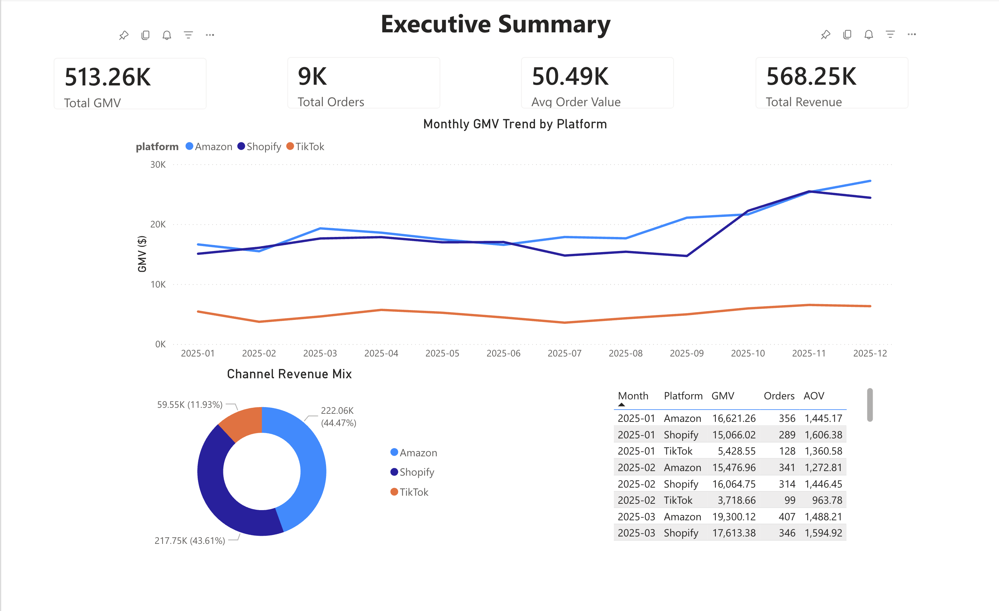
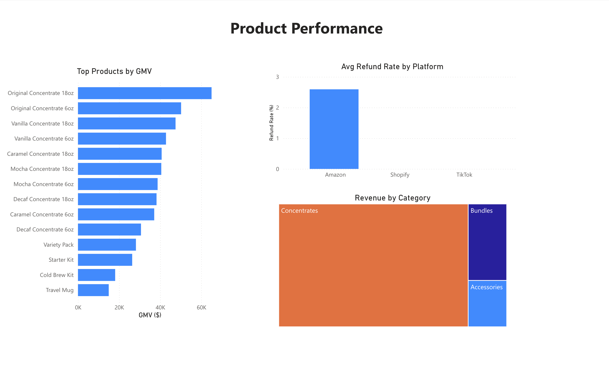
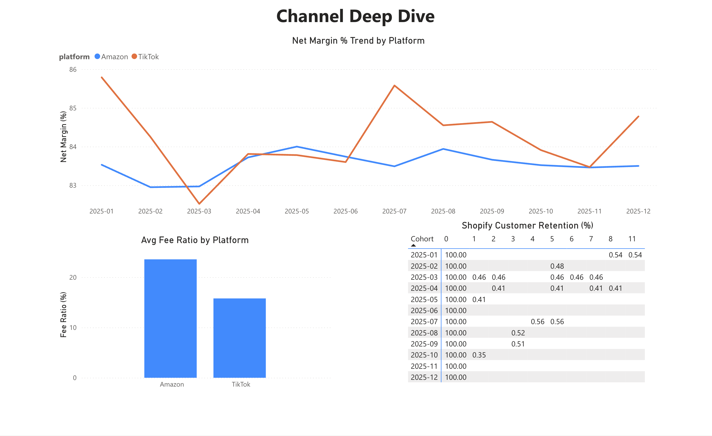
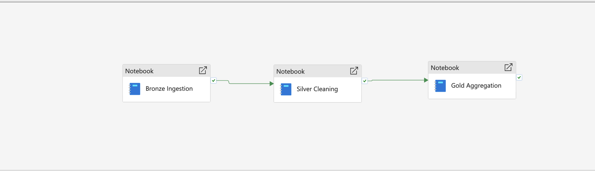

# E-Commerce Growth Analytics Platform

> Multi-channel DTC brand analytics pipeline built on Microsoft Fabric, transforming raw e-commerce data from Shopify, Amazon, and TikTok Shop into actionable business insights.

## Business Context

A simulated US-based DTC coffee concentrate brand (similar to Javy Coffee) selling across three channels:
- **Shopify** — DTC website (~3,000 orders/year)
- **Amazon** — Largest channel, FBA fulfillment (~5,000 orders/year)
- **TikTok Shop** — Emerging channel, creator-driven (~1,500 orders/year)

## Architecture

```
┌──────────────┐   ┌──────────────┐   ┌──────────────┐
│   Shopify    │   │    Amazon    │   │  TikTok Shop │
│  Orders CSV  │   │  Orders TSV  │   │  Settlement  │
│              │   │  Settle TSV  │   │     XLSX     │
└──────┬───────┘   └──────┬───────┘   └──────┬───────┘
       │                  │                  │
       └──────────┬───────┴──────────┬───────┘
                  ▼                  ▼
        ┌────────────────────────────────────┐
        │       Bronze Layer (Raw)           │
        │    Raw files → Delta tables        │
        └────────────────┬───────────────────┘
                         ▼
        ┌────────────────────────────────────┐
        │      Silver Layer (Cleaned)        │
        │   Standardize dates, currency,     │
        │   SKU mapping, dedup, pivot        │
        └────────────────┬───────────────────┘
                         ▼
        ┌────────────────────────────────────┐
        │      Gold Layer (Business)         │
        │    KPI aggregations, summaries     │
        └────────────────┬───────────────────┘
                         ▼
        ┌────────────────────────────────────┐
        │        Power BI Dashboard          │
        │    3-page executive reports        │
        └────────────────────────────────────┘
```

## Tech Stack

| Layer | Technology |
|-------|-----------|
| Data Generation | Python (Faker, Pandas) |
| Lakehouse | Microsoft Fabric |
| ETL | PySpark / Spark SQL (Fabric Notebooks) |
| Orchestration | Fabric Pipeline (scheduled weekly) |
| Modeling | Medallion Architecture (Bronze → Silver → Gold) |
| Visualization | Power BI (DirectLake mode) |
| Version Control | Git + GitHub |

## Project Structure

```
ecommerce-analytics/
├── README.md
├── data/
│   ├── raw/                     # Simulated raw data files
│   │   ├── shopify_orders.csv
│   │   ├── amazon_orders.tsv
│   │   ├── amazon_settlement.tsv
│   │   └── tiktok_settlement.xlsx
│   └── generate_data.py         # Data generation script
├── notebooks/                   # Fabric Notebook exports
│   ├── 01_bronze_ingestion.py
│   ├── 02_silver_cleaning.py
│   └── 03_gold_aggregation.py
├── sql/
│   └── transformations.sql
├── reports/                     # Power BI & pipeline screenshots
├── docs/
│   ├── architecture.md
│   ├── data_dictionary.md
│   └── kpi_definitions.md
└── ai-weekly-report/
    └── generate_report.py
```

## KPI System

### Revenue & Growth
- **Total GMV** — Gross merchandise value by platform
- **Net Revenue** — After platform fees, FBA costs, creator commissions
- **Revenue Growth Rate** — Month-over-month
- **AOV** — Average order value by platform

### Product Performance
- **Top SKUs by Revenue**
- **Return/Refund Rate** — By platform comparison
- **Platform Fee Ratio** — Fee structure across channels

### Customer & Channel
- **Channel Revenue Mix** — Shopify vs Amazon vs TikTok trend
- **Repeat Purchase Rate** — Shopify only (has customer data)
- **TikTok Creator ROI** — Commission vs GMV driven

## Power BI Dashboard

### Executive Summary
GMV trend, channel mix, KPI cards (Total GMV, Orders, AOV, Revenue)



### Product Performance
SKU ranking by GMV, refund rates by platform, revenue by category



### Channel Deep Dive
Net margin trend, fee ratio comparison, Shopify customer cohort retention



## Pipeline Orchestration

Fabric Pipeline automates the full ETL flow: Bronze → Silver → Gold, scheduled weekly.



## Getting Started

### Generate Simulated Data
```bash
cd data
pip install -r requirements.txt
python generate_data.py
```

## License

MIT
