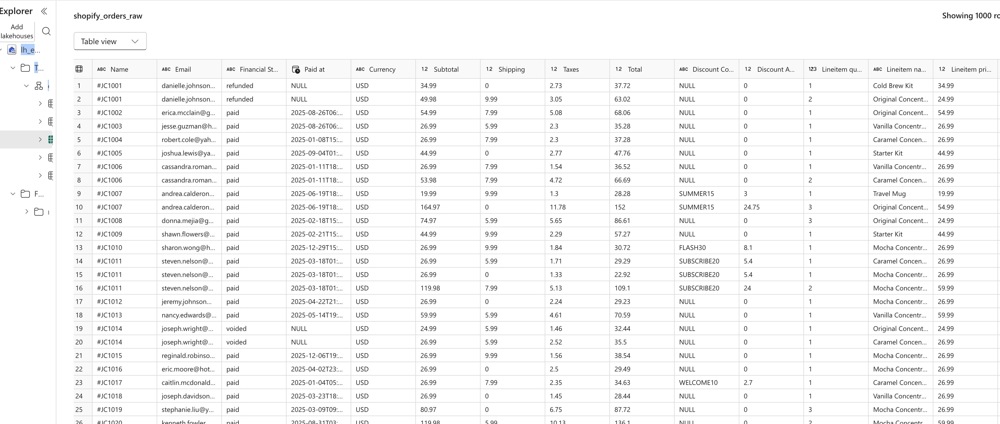
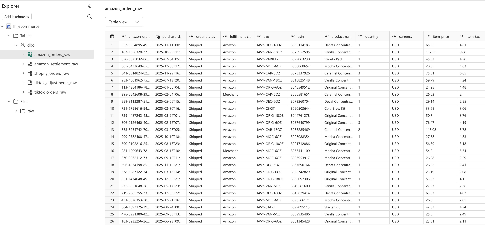
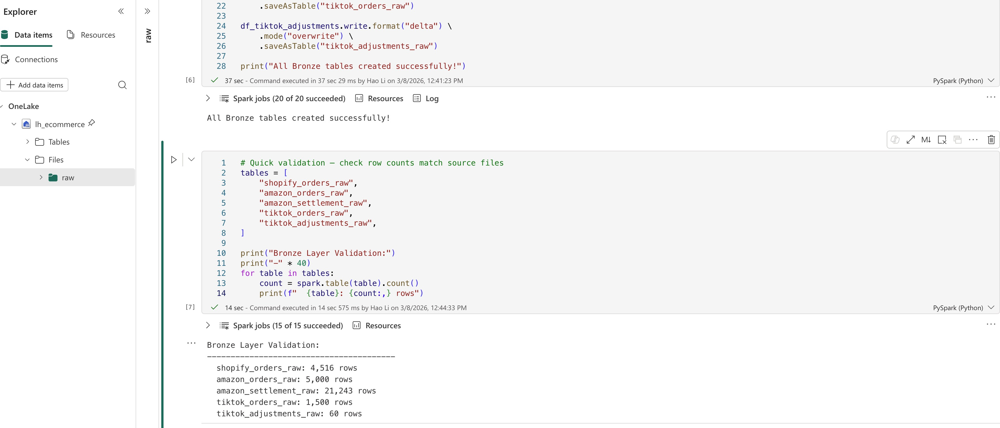
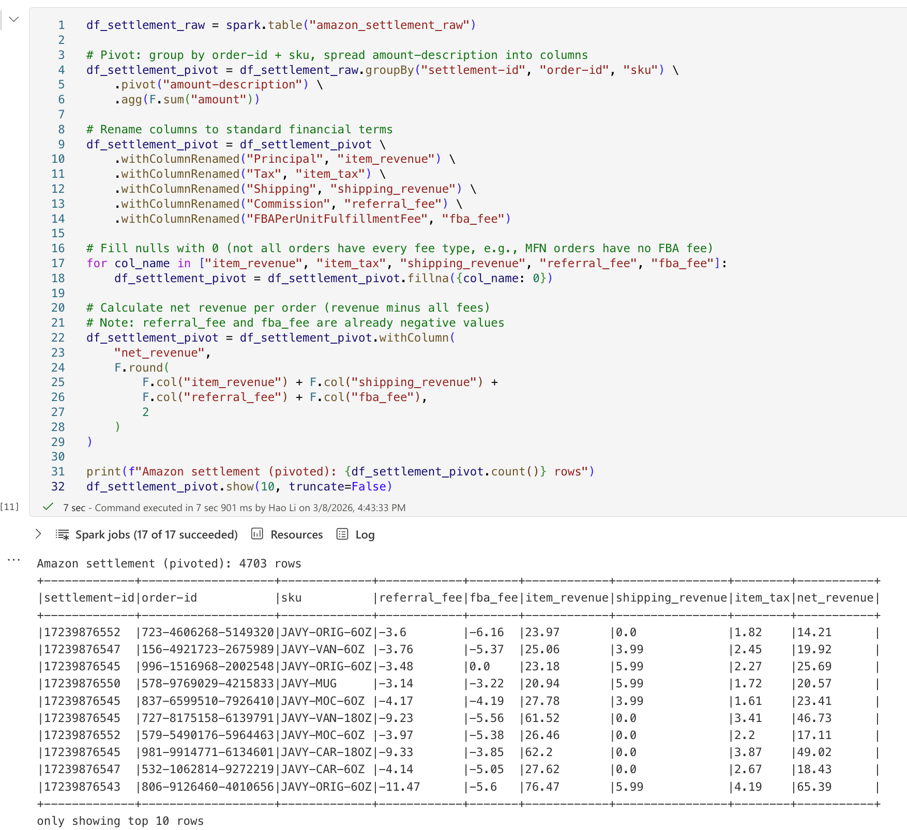
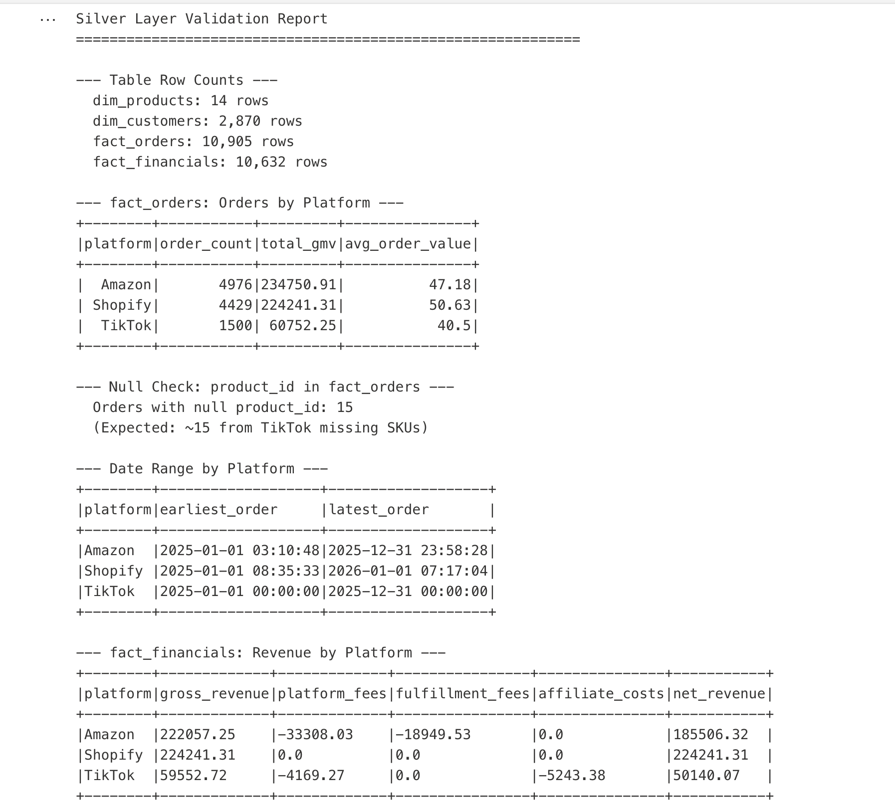

# Original Fabric Implementation — Visual Archive

## Why This Document Exists

This project was originally delivered as a working Microsoft Fabric Lakehouse with a live Power BI dashboard in DirectLake mode. The Fabric trial license has since expired, so the workspace can no longer be opened and the dashboard can no longer be queried. Rather than rebuild on a different stack and pretend the original work didn't happen, this document **consolidates the visual evidence and design rationale of the original implementation in one place**: the 9 runtime/dashboard screenshots that were captured while the workspace was live, grouped by pipeline layer, with the engineering decisions that produced them.

For the per-source schema reference see [`data_dictionary.md`](data_dictionary.md); for KPI formulas see [`kpi_definitions.md`](kpi_definitions.md); for the hands-on Fabric setup steps see [`fabric_guide.md`](fabric_guide.md).

## Architecture Recap

The implementation followed the **Medallion pattern** on a single Fabric Lakehouse:

- **Bronze** — raw source files (Shopify CSV, Amazon TSV ×2, TikTok XLSX) ingested verbatim into Delta tables. No transformation; the goal is an immutable, replayable source-of-truth.
- **Silver** — cleaned, deduped, conformed. Three different date formats unified to UTC; CAD orders converted to USD; Amazon Settlement reshaped from EAV rows to a wide one-row-per-order shape; cross-platform SKUs unified via a 14-product mapping table. Outputs a star schema (`dim_products`, `dim_customers`, `fact_orders`, `fact_order_items`, `fact_financials`).
- **Gold** — business aggregations only. Four tables (`daily_sales_summary`, `product_performance`, `channel_analysis`, `customer_cohort`) sized and shaped for Power BI consumption.
- **Power BI** — DirectLake semantic model `sm_ecommerce` reading the four Gold tables; 3-page report (Executive Summary / Product Performance / Channel Deep Dive).
- **Pipeline** — a Fabric Pipeline (`pl_ecommerce_refresh`) chained the three notebooks Bronze → Silver → Gold and ran on a weekly schedule.

Full layer-by-layer transformation tables live in [`architecture.md`](architecture.md).

## Visual Evidence (9 screenshots)

### Bronze Layer — Raw Ingestion

The Bronze notebook landed each source file into its own Delta table with zero transformation. Goal: prove ingestion is repeatable and source rows are preserved verbatim for audit/replay.

*`shopify_orders_raw` — Shopify CSV landed as Delta. All original columns preserved including the multi-row-per-order shape (one row per line item).*

*`amazon_orders_raw` — Amazon's `All Orders Report` TSV landed unchanged. The ~0.5% duplicate `amazon-order-id` rows are intentionally preserved at this layer; dedup happens in Silver so the raw signal is never lost.*

*Bronze validation cell — row counts per source table after ingestion. This is the smoke test that ran at the end of every Bronze refresh.*

### Silver Layer — Cleaning & Conforming

Silver is where the project's hardest transformation lives: the Amazon Settlement EAV pivot, plus SKU unification, dedup, currency conversion, and date standardization.

*Result of the Amazon Settlement pivot. The source TSV is **Entity-Attribute-Value** shaped (one row per fee component: Principal, Commission, FBA fee, Tax, Shipping), keyed by `order-id`. The Silver layer pivots on `amount-description` to produce one row per order with each fee as its own column. Without this step, per-order net margin is uncomputable.*

*Silver validation — row counts and key invariants checked after each Silver build: `dim_products` (14), `dim_customers` (~2,870 Shopify customers after dedup), `fact_orders` (~10,905), `fact_financials` (~10,632, slightly lower because TikTok adjustments without a parent order are excluded).*

### Pipeline Orchestration

*`pl_ecommerce_refresh` — Fabric Pipeline chaining the three notebooks. Each step is a Notebook Activity with `on success` dependency; the pipeline ran on a weekly schedule (Mondays). Failures in any step short-circuit the rest, so a bad Bronze refresh never silently corrupts Gold.*

### Dashboard (Power BI, DirectLake)

Three pages built on the `sm_ecommerce` semantic model. DirectLake mode means the report reads the Gold Delta tables directly — no import, no scheduled refresh of the model itself.

*Executive Summary — KPI cards (Total GMV, Orders, AOV, Net Revenue), monthly GMV trend, channel mix donut. The page designed for "first 30 seconds of the week" scanning.*

*Product Performance — Top SKUs by GMV (uses the unified `standardized_sku` from Silver), refund rate by platform, revenue by product category. Filtering one platform here cascades to the SKU ranking via the star-schema relationships.*

*Channel Deep Dive — net margin trend per platform, fee ratio comparison (Amazon ~15% referral + FBA; TikTok ~7% + creator commission; Shopify ~0% visible because payment processing isn't in the source data), Shopify customer cohort retention heatmap.*

## Key Engineering Decisions

### Medallion layering
Three layers were chosen over a flatter Raw → Gold design because each layer has a single responsibility: Bronze = replayability, Silver = correctness, Gold = business semantics. When a KPI definition changes, only Gold rebuilds; when a source schema changes, Silver absorbs it without touching Gold. This separation is what makes the pipeline maintainable past the initial build.

### SKU mapping (14 products × 3 channels)
Each channel ships the same physical product under a different SKU (`original-concentrate-6oz` vs `JAVY-ORIG-6OZ` vs `TS-ORIGINAL-6`). Without a unification step, every product-level KPI is meaningless because the same product appears as three separate rows. Silver builds `dim_products` from a hand-maintained mapping table (full table in [`data_dictionary.md`](data_dictionary.md)) and every fact table joins through it to expose `standardized_sku`.

### Amazon Settlement EAV pivot
The Amazon Settlement V2 report is **EAV-shaped**: each fee component (Principal, Commission, FBA fee, Tax, Shipping) is a separate row identified by `amount-description`, all keyed by `order-id`. Silver applies a PySpark `pivot()` on `amount-description` to produce one row per order with each fee in its own column. This is the highest-value transformation in the pipeline — every net-margin and fee-ratio KPI depends on it.

### Currency conversion (TikTok CAD orders)
~5% of TikTok orders arrive in CAD because TikTok Shop allows cross-border. Silver converts these to USD using a fixed reference rate (the rate could be made dynamic via an API call, but for a simulated dataset the simpler fixed-rate approach is honest about its limits).

### Deduplication (Amazon ~0.5%)
Amazon's All Orders Report occasionally emits the same `amazon-order-id` twice (data quality issue documented by Amazon). Silver dedups by `amazon-order-id`, keeping the row with the latest `purchase-date`. The raw dupes remain in Bronze for audit.

### Date standardization
Three input formats: Shopify ISO + TZ offset, Amazon ISO UTC, TikTok `MM/DD/YYYY`. Silver casts everything to UTC `timestamp` so downstream date arithmetic (cohort retention, MoM growth) works against a single timeline.

## Known Limitations of the Original Implementation

These were documented at delivery and have not been retroactively fixed in this archive:

- **Shopify Net Margin = 100%.** Shopify's CSV export doesn't include payment processing fees (~2.9% + $0.30), so net revenue equals gross revenue for that channel. The dashboard's Fee Ratio comparison is therefore Shopify-favoured.
- **TikTok refunds in the Adjustments sheet are not joined back.** Refund Rate as computed treats every TikTok order as non-refunded; actual refund rate is slightly higher. This was a known scope cut at build time.
- **A handful of Shopify orders dated 2026-01 leaked into the 2025 dataset.** They are filter-excluded at the Power BI level rather than fixed upstream — a deliberate trade-off to avoid re-running the generator.

## What I Would Do Differently

If this were rebuilt today rather than archived, the highest-value changes would be:

1. **dbt instead of bare PySpark notebooks.** Notebooks are great for exploration but resist testing. dbt models give you `schema.yml` tests, automated lineage docs, and a clean local dev loop — directly improving the "is this transformation correct?" feedback cycle that Silver desperately needs.
2. **Add data quality tests (Great Expectations or dbt tests).** The known-issue list above (refund undercount, 2026-01 leakage, Net Margin = 100%) would each have surfaced as a failing test rather than a manual readme entry. Tests turn invisible assumptions into asserted invariants.
3. **Switch storage from Delta to Iceberg.** Delta is excellent inside Fabric/Databricks but Iceberg is more vendor-neutral. For a portfolio project that hopes to be readable in 3 years across whatever compute stack is current, Iceberg ages better.
4. **Add period-over-period comparisons to every dashboard page.** Every KPI is currently a current-period absolute. The single highest-leverage UX addition would be "vs. prior week / vs. same week last year" on every card and trend line — that's what stakeholders actually ask in the next meeting.
5. **Stop using DirectLake unless the source actually changes hourly.** DirectLake's benefit is real-time freshness, but the source data here refreshes weekly via Pipeline. Import mode would have been simpler, cheaper, and just as fresh — DirectLake was chosen for the keyword, not the use case. An honest rebuild would right-size the engine to the cadence.
